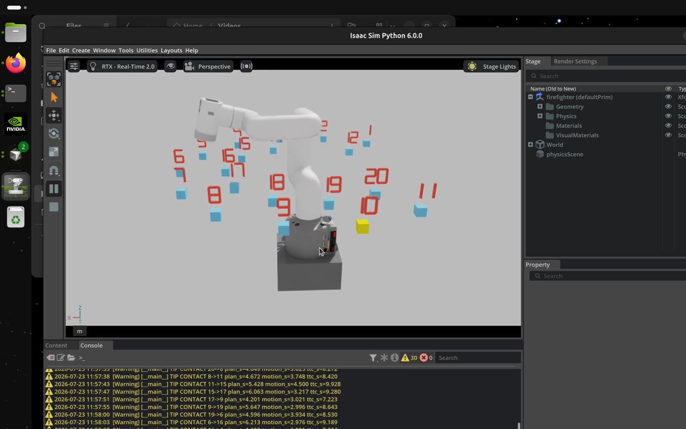
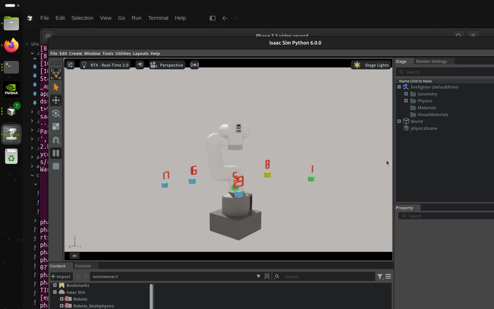
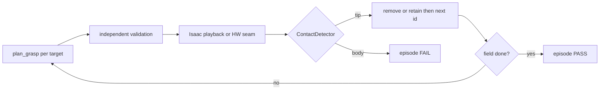

# MyCobot 280 M5 Constrained Approach Planner

Deterministic, collision-aware surface-normal approach planning for the
Elephant Robotics MyCobot 280 M5 using NVIDIA cuRobo **v0.8.0 (cuRoboV2)**.
cuRobo is the exclusive global and local motion planner: no fallback, learned
policy, simulator, ROS integration, hardware adapter, or external package may
generate a replacement motion path.

This repository is a new design. It is not an in-place continuation of
`spark_isaac_mycobot_v2`: v2's Isaac visualization, ROS integration, learned
residual implementation, distance-dependent recovery, and legacy cuRobo
`MotionGen` code are intentionally not carried forward.

The authoritative requirements are in [`spec.md`](spec.md). Cursor guidance in
[`.cursor/rules/`](.cursor/rules/) is also authoritative.

### Project size (snapshot 2026-07-23)

Tracked files excluding vendored `third_party/`, `assets/`, and `artifacts/`
(regenerate with `git ls-files | grep -Ev '^(third_party/|assets/|artifacts/)'
| xargs wc -l`):

| Type | Files | Lines |
|------|-------|-------|
| Python (`.py`) | 84 | 17,382 |
| Shell (`.sh`) | 20 | 1,855 |
| YAML (`.yml`) | 18 | 5,888 |
| Markdown (`.md`) | 32 | 11,729 |
| Other (rules, TOML, JSON, …) | 25 | ~6,020 |
| **Total** | **179** | **42,874** |

**AI context utilization (worst case).** The tracked corpus is ~1.6 MB of
text, roughly 400k LLM tokens — about **2×** a ~200k-token agent context
window, so "read everything" is impossible and the agent works by selective
retrieval. A complex cross-cutting change typically carries ~15–20k tokens
of fixed overhead (system prompt, workspace rules, tool schemas) plus
60–120k tokens of retrieved content (`spec.md` sections, several core
modules, tests, configs, phase docs) and conversation/tool output, i.e.
**50–80% of the window per turn**; long sessions reach 100% and older
context is summarized. Treat one full window (~200k tokens ≈ a quarter to a
half of the corpus per pass) as the practical worst-case upper bound.

## Table of contents — phases

Full roadmap: [`docs/implementation_phases.md`](docs/implementation_phases.md).
Acceptance status: [`STATUS.md`](STATUS.md). Change log: [`CHANGES.md`](CHANGES.md).

| Phase | Status | Quick description | Docs |
|------:|--------|-------------------|------|
| 0 | Complete | Reproducible env; fail closed without cuRobo v0.8.0 | [`phase0_environment.md`](docs/phase0_environment.md) |
| 1 | Complete | MyCobot YAML, spheres, TCP, joint/frame contracts | [`phase1_robot_model.md`](docs/phase1_robot_model.md) |
| 1.1 | Complete | Target-scale dual-overlay collision spheres (Option B) | [`phase1_1_target_scale_collision_spheres.md`](docs/phase1_1_target_scale_collision_spheres.md) |
| 2 | Complete | Surface targets → task frames + approach axis | [`phase2_task_frames.md`](docs/phase2_task_frames.md) |
| 3 | Complete | `plan_grasp` nominal free-space + terminal approach | [`phase3_nominal_planning.md`](docs/phase3_nominal_planning.md) |
| 4 | Complete | Independent FK validation before executable status | [`phase4_validation.md`](docs/phase4_validation.md) |
| 5 | Complete | Zero-residual execution seam + residual hook | [`phase5_execution_residual.md`](docs/phase5_execution_residual.md) |
| 6 | Complete | Randomized workspace benchmark + failure taxonomy | [`phase6_benchmark.md`](docs/phase6_benchmark.md) |
| 7 | Complete | Isaac Sim validated-plan playback + tip metrics | [`phase7_isaac_sim.md`](docs/phase7_isaac_sim.md) |
| 7.1 | Complete | Unknown-start cube approach visualization suite | [`phase7_1_cube_approach.md`](docs/phase7_1_cube_approach.md) |
| 7.2 | Complete | Multi-target tip-contact clearance suite | [`phase7_2_multi_target_contact.md`](docs/phase7_2_multi_target_contact.md) |
| 7.3 | Complete | Controllable target-block placement (`random` / `layout`) | [`phase7_3_target_placement.md`](docs/phase7_3_target_placement.md) |
| 7.4 | Partial / closed | Z-band + Z-aware EE floor; wide-band evidence waived | [`phase7_4_z_variability.md`](docs/phase7_4_z_variability.md) |
| 7.5 | Complete / landed | Incremental Z-density stress; PhysX accept/regen | [`phase7_5_variable_target_stress.md`](docs/phase7_5_variable_target_stress.md) |
| 8 | **Open** (`wip_phase8`) | Bounded residual RL subordinate to cuRobo + validation | [roadmap §8](docs/implementation_phases.md#phase-8--bounded-residual-rl-isaac-lab--isaac-sim) |
| 9 | Planned | Fabricated flange contact tool (OpenSCAD / STL) | [`phase9_contact_tool.md`](docs/phase9_contact_tool.md) |
| 9.1 | Planned | Tool calibration / sim / optional residual eval | [`phase9_1_tool_evaluation.md`](docs/phase9_1_tool_evaluation.md) |
| 10 | Planned | Hardware adapter; motion disabled by default | [roadmap §10](docs/implementation_phases.md#phase-10--hardware-interface-and-dry-run-execution) |
| 11 | Planned | Gated physical MyCobot validation | [roadmap §11](docs/implementation_phases.md#phase-11--physical-mycobot-280-m5-validation) |

### Demo videos

GitHub’s markdown view does **not** execute repository `.html` players and
does not stream repository `.mp4` files from relative links. Use the
GitHub-hosted players below (click poster → GitHub’s built-in video viewer,
or the inline `user-attachments` stream). Local HTML under
[`docs/videos/`](docs/videos/) still works from a clone.

**Phase 7.3 — densest 2×20** (inline on GitHub via `user-attachments`):

https://github.com/user-attachments/assets/e1632486-8215-4b7e-8963-d726cd621b28

[](https://github.com/jywilson2/spark_isaac_mycobot_v3/blob/main/docs/videos/mycobot_280_m5_2x20.mp4)

Offline: [`play HTML`](docs/videos/mycobot_280_m5_2x20.html) ·
[`mp4`](docs/videos/mycobot_280_m5_2x20.mp4)

**Phase 7.5 — `n6-4-8` seed-4242** (click poster → GitHub video viewer):

[](https://github.com/jywilson2/spark_isaac_mycobot_v3/blob/main/docs/videos/phase7_5-variable_dz0_30_n6-4-8_seed4242.mp4)

Offline: [`play HTML`](docs/videos/phase7_5-variable_dz0_30_n6-4-8_seed4242.html) ·
[`mp4`](docs/videos/phase7_5-variable_dz0_30_n6-4-8_seed4242.mp4)

Index: [`docs/videos/README.md`](docs/videos/README.md).

## Current phase

**Active branch:** `wip_phase8` — Phase 8 bounded residual RL (sim only).

### Just completed (Phase 7.5)

- Variable-target-count Z-density stress (`target_population: incremental`)
- Post-contact retreat so next legs start clear of retained cubes
- Maze corridor pre-filter (in-order navigability)
- Inter-episode full clear of `/World/Phase7_2/Targets`
- PhysX tip/body/self fail-closed evidence (`phase7_2_physx:`)
- Post-episode host PhysX accept/regen (`max_physx_regenerations`)
- Suite self-collision clearance floor `0.003` m
- Operator-reviewed evidence: seed-4242 `n6-4-8`, tip=18, body=0, self=0
- Demo video + record helper:
  [`docs/phase7_5_variable_target_stress.md`](docs/phase7_5_variable_target_stress.md),
  `scripts/host/smoke_phase7_5_variable_dz_0_30.sh`,
  `scripts/host/record_frozen_bundle_gui.sh`,
  [`docs/console_log_keys.md`](docs/console_log_keys.md),
  [`.cursor/rules/35-isaac-smoke-physx-and-logs.mdc`](.cursor/rules/35-isaac-smoke-physx-and-logs.mdc)

### Earlier Phase 7.x (complete unless noted)

- **7** — Isaac validated-plan playback
  ([`phase7_isaac_sim.md`](docs/phase7_isaac_sim.md))
- **7.1** — Unknown-start cube approach suite
  ([`phase7_1_cube_approach.md`](docs/phase7_1_cube_approach.md))
- **7.2** — Multi-target tip-contact clearance
  ([`phase7_2_multi_target_contact.md`](docs/phase7_2_multi_target_contact.md))
- **7.3** — Controllable placement + 2×20 demo video
  ([`phase7_3_target_placement.md`](docs/phase7_3_target_placement.md))
- **7.4** — Z variability; wide-band fixed-count evidence partial / closed
  ([`phase7_4_z_variability.md`](docs/phase7_4_z_variability.md))



### Stack already in place (Phases 0–6)

- Python `src/` package; cuRobo v0.8.0 pin; runtime/version guard; CUDA check
- Robot model, dual-overlay spheres, FK fixtures, self-collision warmup
- Typed surface targets / roll goal sets / `GoalToolPose` conversion
- `plan_grasp` + independent validation + zero-residual execution seam
- Randomized benchmark, frozen fixtures, failure taxonomy, JSON/Markdown reports
- Isaac Sim 6.x headless/GUI player with PhysX contact evidence

### Not implemented yet

- Generic non-empty-world clearance beyond the Phase 7.1 cube adapter
- Non-zero residual correction / residual RL training (**Phase 8** — open)
- Fabricated contact tool and evaluation (Phases 9 / 9.1)
- Hardware dry-run and physical validation (Phases 10–11)

## Install

Use Python 3.10 or newer in a CUDA-capable NVIDIA environment. The direct
dependency pins cuRobo to the exact `v0.8.0` Git tag. Select the matching CUDA
runtime extra without allowing pip to replace an existing CUDA-enabled PyTorch:

```bash
python3 -m venv .venv
source .venv/bin/activate
python -m pip install --upgrade pip
python -m pip install -e '.[dev,cuda13]'  # DGX Spark / CUDA 13
# or: python -m pip install -e '.[dev,cuda12]'
```

In the Isaac ROS / Cursor container, install only the lightweight lint tool
when needed (do not pull cuRobo/CUDA into that bootstrap):

```bash
./scripts/ensure_container_dev_tools.sh   # Ruff-only venv
./scripts/run_verification.sh ci          # auto-bootstraps Ruff if missing
```

PyTorch must match the installed NVIDIA driver/CUDA environment. If the default
resolver selects an incompatible wheel, install the correct PyTorch CUDA wheel
first, then repeat the editable install. Do not use CPU planning or another
planner as a fallback. Future CPU planning is permitted only if the pinned
cuRobo implementation supports it and project validation covers it.

On the Isaac Sim host, use `scripts/host/install_curobo.sh`; it deliberately
installs cuRobo's `cu13` runtime extra without a Torch extra so Isaac Sim's
cu130 wheel is preserved.

## Verify Phase 0

Lightweight tests do not construct a planner and can run without a GPU:

```bash
pytest tests/unit
ruff check .
ruff format --check .
```

On the CUDA/cuRobo host:

```bash
python scripts/verify_environment.py \
  --output artifacts/reports/environment.json
pytest -m gpu tests/integration
```

The verifier records:

- Python, cuRobo, and PyTorch versions;
- cuRobo source revision when install metadata provides it;
- CUDA runtime visible to PyTorch;
- CUDA availability and GPU name;
- selected device and dtype;
- public cuRoboV2 API import status;
- GPU tensor-allocation status.

It exits nonzero if the exact cuRobo baseline, required public APIs, CUDA, or
GPU allocation are unavailable.

## Inspect Phase 1 robot model

Obtain the pinned vendor URDF/meshes, then inspect CPU metadata/FK:

```bash
./scripts/download_mycobot_ros2.sh
python3 scripts/inspect_robot_model.py
```

On the DGX Spark host, construct and warm the cuRobo planner:

```bash
./scripts/host/spark_host_exec.sh \
  ./scripts/host/inspect_robot_model.sh
```

The model uses `g_base`, `joint6_flange`, and an explicit identity
`tcp_link` for the bare flange. A fitted tool requires a measured fixed TCP
transform. See [`docs/phase1_robot_model.md`](docs/phase1_robot_model.md).

## Build Phase 2 task frames

```python
from mycobot_curobo import SurfaceTarget, build_surface_goal_set

target = SurfaceTarget.create(
    position_base_m=[0.15, 0.0, 0.20],
    surface_normal_base=[0.0, 0.0, 1.0],
    tangent_hint_base=[1.0, 0.0, 0.0],
    pre_approach_distance_m=0.05,
    target_id="example",
)
goal_set = build_surface_goal_set(target)
```

The default signed axis is tool Z × **+1** (bare-flange tip face) and the
desired motion direction is against the outward normal. Defaults and roll
angles come from `config/app.yml`; see
[`docs/phase2_task_frames.md`](docs/phase2_task_frames.md).

## Plan a Phase 3 nominal approach

`NominalPlanner` accepts a backend factory, not a reusable backend. The pinned
cuRobo v0.8.0 runtime changed internal optimizer/tool-criteria state after
`plan_grasp`; repeated use could shorten or fail later trajectories. Phase 4
also found that an unwarmed fresh backend could report success while remaining
at the pre-approach endpoint. Every request and retry therefore constructs a
fresh backend, resets its seed, performs configured public warmup, resets the
seed again, and invokes `plan_grasp` exactly once:

```python
from mycobot_curobo import (
    NominalPlanner,
    TaskFrameConfig,
    create_curobo_planner,
    load_planner_profile,
)

profile = load_planner_profile("development_fast")
planner = NominalPlanner(
    lambda: create_curobo_planner(profile, warmup=False),
    profile,
    task_frame_config=TaskFrameConfig(),
)
outcome = planner.plan(request)
```

Named profiles live in `config/planner_profiles.yml`
(`development_fast`, `validation_strict`, `benchmark_reproducible`,
`planning_high_effort` — higher trajopt/attempt budget with IK seeds held at
benchmark `32`; orientation tolerance must stay ≤ Phase 4 validation; not
currently the integration 2×5 profile).

This reliability-first lifecycle includes construction and warmup in request
wall time. Returned nominal plans remain `executable=False` until Phase 4
independently validates every waypoint. See
[`docs/phase3_nominal_planning.md`](docs/phase3_nominal_planning.md).

### Phase 3 implementation libraries

| Library | Pinned use |
|---|---|
| NVIDIA cuRobo v0.8.0 | `MotionPlanner`, `MotionPlannerCfg`, `plan_grasp`, `JointState` |
| NumPy | fail-closed tensor conversion and trajectory validation |
| PyYAML | planner-profile and empty-scene configuration |
| pytest | CPU orchestration tests and GPU lifecycle regression |

## Validate a Phase 4 nominal plan

`validate_nominal_plan` combines a typed `ValidationProfile` with an injected
trajectory evaluator. It checks the terminal corridor, approach axis, selected
roll, target progress, endpoint pose, joint margins and dynamics, segment
boundary, and available collision clearances. Violations identify the first
offending waypoint; only a valid `ValidatedPlan` is executable.

Thresholds live in `config/validation_profiles.yml`. The GPU test uses
`CuroboTrajectoryEvaluator` for real cuRobo FK and self-collision clearances in
an explicitly empty world. Non-empty-world clearance is not yet implemented:
it is reported as unevaluated and fails closed. See
[`docs/phase4_validation.md`](docs/phase4_validation.md).

### Phase 4 implementation libraries

| Library | Pinned use |
|---|---|
| NVIDIA cuRobo v0.8.0 | terminal-waypoint FK and collision-sphere state |
| NumPy | deterministic geometry, limits, dynamics, and report metrics |
| PyYAML | named validation threshold profiles |
| pytest | synthetic violation coverage and GPU acceptance |

## Replay a Phase 5 validated plan

`TrajectoryExecutor` accepts only a valid executable `ValidatedPlan`. It samples
the unchanged nominal trajectory, uses `ReplayRobotStateProvider` for the
initial measured-state contract, invokes `ZeroResidualCorrector`, and passes
every waypoint through `SafetyProjector` before `InMemoryCommandAdapter` can
record it.

Bounds in `config/residual_safety.yml` cover residual magnitude, the terminal
corridor, joint margin, state age, and watchdog timeout. Oversized residuals
are visibly clipped; unsafe residuals are rejected. Phase 5 deliberately
rejects every non-zero residual at execution because no bounded
Cartesian-to-joint mapping has been accepted. See
[`docs/phase5_execution_residual.md`](docs/phase5_execution_residual.md).

## Run the Phase 6 workspace benchmark

The declared `g_base` regions in `config/benchmark_workspace.yml` are
conservative unmeasured candidate regions, not a measured dexterous envelope.
Run the frozen smoke stage and replay a failed serialized request with:

```bash
python3 scripts/benchmark_random_targets.py --stage smoke --root-seed 6006
python3 scripts/plan_single_target.py \
  artifacts/benchmarks/phase6_smoke_seed_6006.json --failed-index 0
```

Reports default to `artifacts/benchmarks/` in matching JSON and Markdown.
Every attempt contributes to the rates; failures are never dropped. Planner
seed sweeps create a fresh copied profile with the requested seed. Optional
zero-residual execution rejection is reported separately from planning
failures. See [`docs/phase6_benchmark.md`](docs/phase6_benchmark.md).

## Play a Phase 7 plan in Isaac Sim

Kit runs natively on the DGX Spark host. The player refuses non-executable
plans before starting `SimulationApp`, maps the exact six joint names, and
writes simulation pose metrics separately from cuRobo validation metrics.

```bash
./scripts/download_mycobot_ros2.sh          # vendor URDF + meshes (local)
./scripts/host/check_prereqs.sh             # host: Isaac python.sh + URDF
./scripts/convert_urdf_to_usd.sh            # host: URDF → USD
./scripts/host/smoke_isaac_viz.sh --headless
./scripts/host/smoke_isaac_viz.sh --gui --auto-exit
# From the Isaac ROS container:
./scripts/host/spark_host_exec.sh \
  ./scripts/host/smoke_isaac_viz.sh --gui --auto-exit
# Keep the window open to verify stage lighting (close Kit to finish):
./scripts/host/spark_host_exec.sh \
  ./scripts/host/smoke_isaac_viz.sh --gui --no-auto-exit
```

Players disable Kit auto light-rig before opening the robot USD so the GUI does
not toast "No lights found… applying Default" and hide stage lights.

`./scripts/run_verification.sh spark` requires the auto-exiting GUI smoke; no
environment bypass is supported. A missing `tcp_link` in the imported USD does
not fabricate results: joint playback may complete while tip metrics are null
and marked unevaluated. See
[`docs/phase7_isaac_sim.md`](docs/phase7_isaac_sim.md).

## Phase 7.1 cube approach suite

Phase 7.1 samples **5 episodes by default** with independent unknown starts
(Mode A) and diverse 3D cube goals/normals (Mode D). Chained starts (B) and
relocate-then-approach (C) are optional runtime modes, but acceptance testing
must exercise all A–D modes.

The default cube edge is **14 mm**, derived as approximately 25% of the area of
an assumed 31 mm circular flange face. Phase 9 must measure that assumption.
The default terminal standoff is **0.08 m** so collision spheres clear the cube
at the Phase 4/7.1 grasp pose; Mode D samples FK-aligned cubes from a seeded
goal-joint bank inside declared `g_base` AABBs. Reports include lateral/axis
errors, clearances, prohibited Isaac contacts, failures, p50/p95, seed, and
frozen replay inputs. Unevaluated non-cube non-empty worlds still fail closed.
Isaac tip metrics remain null/`not_evaluated`; see
[`docs/phase7_1_cube_approach.md`](docs/phase7_1_cube_approach.md).

Host smoke plans in a cuRobo-only process, then plays in Kit with lighting,
static contact-reporting cubes, labeled resets, and drive-target motion:

```bash
./scripts/host/spark_host_exec.sh \
  ./scripts/host/smoke_phase7_1_cube_suite.sh --gui --auto-exit --all-modes
```

Mode B chained GUI (continue from last success, no home reset between cubes).
Host-native script; planner uses `--chained` + `--episodes` on the base suite
YAML. Pass `--GUI` (or `--gui`) so Kit opens on the host display (default):

```bash
./scripts/host/run_phase7_1_chained_gui.sh --GUI            # 20 eps, keep GUI open
./scripts/host/run_phase7_1_chained_gui.sh --gui --episodes 20
```

From the Isaac ROS container, delegate the same script (pass the script path,
not `bash -lc '...'`):

```bash
./scripts/host/spark_host_exec.sh ./scripts/host/run_phase7_1_chained_gui.sh --GUI
```


## Phase 7.2 multi-target tip-contact suite

Phase 7.2 clears a numbered multi-target field with flange-normal tip contact.
Playback highlights the current target yellow (pending), green on tip contact,
and red on tip-miss or body contact. Other remaining targets stay cuRobo
obstacles for tip and body (only the active contact cube is stripped from the
planning world). Default YAML uses two FK-reachable manual targets; host smoke
can override the count:

```bash
./scripts/host/smoke_phase7_2_multi_target.sh --gui --no-auto-exit
./scripts/host/smoke_phase7_2_multi_target.sh --gui --no-auto-exit --targets 5
./scripts/host/smoke_phase7_2_multi_target.sh --gui --no-auto-exit --targets 10 --episodes 5
./scripts/host/smoke_phase7_2_multi_target.sh --gui --no-auto-exit --manual
# Integration-only (2×5; multi-quadrant open arc + base keep-out):
./scripts/host/smoke_phase7_2_integration_2x5.sh --gui --auto-exit
# Reproduce a prior layout (seed is logged as phase7_2_plan: root_seed=N):
./scripts/host/smoke_phase7_2_integration_2x5.sh --gui --auto-exit --root-seed 4242
./scripts/run_verification.sh spark --with-integration-smoke
# Standard denser suite (2×10; dedicated YAML, not a default CLI override):
./scripts/host/smoke_phase7_2_standard_2x10.sh --gui --auto-exit
# Densest suite (2×20; two-ring manual field, 14 mm cubes):
./scripts/host/smoke_phase7_2_standard_2x20.sh --gui --auto-exit
# Record the Kit window to an mp4 for demo documentation (GUI only):
./scripts/host/smoke_phase7_2_standard_2x20.sh --gui --auto-exit --record /tmp/phase7_2_demo.mp4
```

A recorded 2×20 GUI run is committed as the Phase 7.3 demo (see
[`docs/phase7_3_target_placement.md`](docs/phase7_3_target_placement.md);
local click-to-play:
[`docs/videos/mycobot_280_m5_2x20.html`](docs/videos/mycobot_280_m5_2x20.html)).
Phase 7.5 adds a second demo for the incremental Z-density suite
(`n6-4-8` seed-4242):
[`docs/videos/phase7_5-variable_dz0_30_n6-4-8_seed4242.html`](docs/videos/phase7_5-variable_dz0_30_n6-4-8_seed4242.html)
(see [`docs/phase7_5_variable_target_stress.md`](docs/phase7_5_variable_target_stress.md)).
The player below streams the Phase 7.3 1:58 video. It is a GitHub
`user-attachments` asset — the only source GitHub renders as an inline
player; repository copies (HTML players, mp4, GIF, poster) live in
[`docs/videos/`](docs/videos/) for forks and offline use:

https://github.com/user-attachments/assets/e1632486-8215-4b7e-8963-d726cd621b28

`--no-auto-exit` keeps replaying episodes indefinitely after the first pass
(close the window or Ctrl+C to finish). Playback still runs if planning reports
incomplete clearance, so you can inspect motion for validated legs. The
integration 2×5 smoke is opt-in (not the default spark gate); see
[`docs/phase7_2_multi_target_contact.md`](docs/phase7_2_multi_target_contact.md)
§ Placement / viewport / anti-graze for the current field and framing.
Measured +Z tip-contact candidate map (before further field expand):
`scripts/host/measure_tip_contact_workspace.py` →
`artifacts/workspace/tip_contact_workspace_v1.json`.
Integration 2×5 enables `require_flange_face_containment` with flange-sized
cubes (`target_edge_m: 0.031`) so tip contact does not overhang the face.

`--targets N`, `--episodes N`, and `--root-seed N` are defined in
[`spec.md`](spec.md) §8 Phase 7.2 / §9. Omitting `--root-seed` draws an
independent random seed for each episode (maximize coverage); pass
`--root-seed N` to reproduce. `--record FILE.mp4` (GUI only) captures the
Isaac Sim window via `ffmpeg` x11grab — system ffmpeg or the static build
bundled with Isaac Sim's python — for demo videos; it never affects the
suite result (see the phase 7.2 report, Host CLI overrides). Failure budgets: per-target planning retries
(`max_planning_failure_per_target`, default 3), then deferral / reconsider
(`max_reconsider_passes`, default `target_count`); suite episode ceiling
(`max_failed_episodes`, default 0). Episodes FAIL if any target remains
unplanned. See
[`docs/phase7_2_multi_target_contact.md`](docs/phase7_2_multi_target_contact.md).

The overrides change counts only; field geometry, budgets, and validation
flags stay with the selected YAML. For one-off runs that fit the existing
field, use `--targets` / `--episodes`; for a recurring named size or any
retuned field/budget, add a dedicated YAML plus a pinned wrapper script. See
[`docs/phase7_2_multi_target_contact.md`](docs/phase7_2_multi_target_contact.md)
§ When to create a dedicated suite vs `--targets` / `--episodes`.

## Planned Phase 9/9.1 contact tool

Phase 9 will measure the flange and create a short, stiff contact tool as
parameterized OpenSCAD source plus a matching manifold/watertight printable
STL. The optional tool profile will include explicit TCP, visual, and collision
geometry while leaving the bare-flange profile as default. See
[`docs/phase9_contact_tool.md`](docs/phase9_contact_tool.md).

Phase 9.1 will characterize dimensional accuracy, calibration uncertainty,
remounting repeatability, FK, collision behavior, and seeded tool-profile cube
episodes without powered arm motion. Only this calibrated profile may enable
evaluated tool-tip metrics; Phase 7.1 remains `not_evaluated`. See
[`docs/phase9_1_tool_evaluation.md`](docs/phase9_1_tool_evaluation.md).

## Safety boundary

This project plans, validates, and dry-run replays only; it does not command a
robot. Plans are not executable until independent waypoint-by-waypoint
validation passes. Residual RL (Phase 8) remains bounded and subordinate to
deterministic safety logic. Residuals may apply local execution corrections
but may not generate replacement trajectories or full pose-to-joint solutions.
Physical motion (Phases 10–11) is gated and dry-run by default.

## Branch policy

Each phase is developed and retained on `wip_phaseN`; decimal phase names use
an underscore (`wip_phase7_1`, `wip_phase9_1`). After its acceptance gates
pass, that branch is rebased onto the latest `main` (Phase 0 initializes
`main`), pushed, and then `main` is fast-forwarded to the exact tested commit.
The next roadmap phase branches from updated `main`. This preserves historical
phase states while `main` represents the most current completed functionality.

## License

Apache-2.0. See [`LICENSE`](LICENSE).

