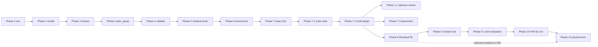

# Implementation phases — MyCobot 280 M5 Constrained Approach Planner

Authoritative acceptance criteria remain in [`spec.md`](../spec.md) §8.
This document is the operational roadmap: what each phase delivers, what it
must not do, and how later Isaac / residual-RL / hardware work attaches without
weakening cuRobo's exclusive ownership of global and local motion planning.
No phase may introduce another path-generating planner, including as a retry,
fallback, learned policy, simulator feature, or integration.

## Phase map

| Phase | Name | Gate before next phase |
|-------|------|------------------------|
| **0** | Repository bootstrap & environment verification | Version guard + unit suite green |
| **1** | Robot model & cuRobo robot configuration | FK / joint names / spheres validated |
| **2** | Surface target & task-frame generation | Frame + roll candidates deterministic |
| **3** | cuRobo nominal planning (`plan_grasp`) | Approach-only plans on empty/obstacle scenes |
| **4** | Independent trajectory verification | Fail-closed validation report |
| **5** | Execution abstraction & residual-correction seam | `ZeroResidualCorrector` + `SafetyProjector` |
| **6** | Randomized workspace benchmark | JSON/Markdown metrics, failure taxonomy |
| **7** | Isaac Sim closed-loop visualization & sim validation | GUI/headless smoke of validated plans |
| **7.1** | Unknown-start normal-approach cube visualization | Five-episode default; all A–D modes validated |
| **7.2** | Multi-target tip-contact clearance suite | Clear/contact all targets per episode; tip OK; body fails |
| **8** | Bounded residual RL (Isaac Lab / Isaac Sim only) | Residual improves sim metrics; never replaces planner |
| **9** | Fabricated contact test tool | OpenSCAD/STL, fit, optional TCP/collision profile |
| **9.1** | Contact test tool evaluation | Calibration and remounting repeatability characterized |
| **10** | Hardware interface & dry-run execution | Adapter tested with motion disabled |
| **11** | Physical MyCobot 280 M5 validation | Gated hardware runs; no sim accuracy claims |

Phases **0–6** are the **initial project** (definition of done in `spec.md` §14).
Phases **7–11** are explicitly planned extensions. Scaffolding for Phase 7
(Isaac host scripts, URDF helpers, vendor obtain script) may land early, but
must not become a Phase 0–6 runtime dependency of `mycobot_curobo`.

---

## Phase 0 — Bootstrap and environment verification

**Objective:** Reproducible Python project that fails closed without cuRobo v0.8.0.

**Deliverables:** `pyproject.toml`, `version_guard`, `verify_environment.py`, unit + GPU-marked import tests.

**Must not:** Import Isaac, ROS, `pymycobot`, or RL frameworks into the core package.

---

## Phase 1 — MyCobot 280 M5 model and cuRobo configuration

**Objective:** Authoritative robot YAML + collision spheres + TCP, with provenance.

**Deliverables:** `config/robots/mycobot_280_m5.yml`, sphere set, inspect script, FK tests.

**Must not:** Treat v2 URDF copies as accepted without license/revision review.

---

## Phase 1.1 — Target-scale collision-sphere coverage

**Branch:** `wip_phase7_3`

**Status:** Option A thickness-capped cover implemented (1012 spheres /
`E=0.014 m`); disarmed — planning regressions vs 7.1/7.2 GPU when armed. See
[`spec.md`](../spec.md) §8 Phase 1.1 and
[`docs/phase1_1_target_scale_collision_spheres.md`](phase1_1_target_scale_collision_spheres.md).

**Objective:** Offline, mesh-constrained, sparse static spheres so cuRobo
detects cuboid obstacles of edge ≥ Phase 7.2 `target_edge_m` (default 14 mm)
without using PhysX as the planner collision oracle.

**Must not:** Animate spheres; import PhysX into core planning.

**Entry criteria:** Phase 1 complete; Phase 7.2 collision policy landed.

---

## Phase 2 — Surface target and task-frame generation

**Objective:** Build full task frames (position + orientation + approach axis) from surface targets.

**Deliverables:** `frames.py`, `targets.py`, roll-candidate goal sets, degeneracy handling.

---

## Phase 3 — cuRobo nominal planning

**Objective:** `MotionPlanner.plan_grasp` owns free-space + terminal approach.

**Deliverables:** Planner factory, result mapping, and the pinned-v0.8.0
lifecycle: fresh backend → seed reset → configured public warmup → seed reset
→ exactly one `plan_grasp`. Retries repeat the full sequence with another fresh
backend. Reuse may return only after a future pinned version passes the GPU
repeated-call and endpoint regressions.

**Must not:** Legacy `MotionGen`, moving collision spheres for path shaping, or
any non-cuRobo planner switching. A documented fallback may use a different
pinned cuRobo API sequence but may not invoke another planner.

---

## Phase 4 — Independent trajectory verification

**Objective:** Re-check every candidate with FK-based geometry before executable status.

**Deliverables:** Typed profiles, evaluator batches, violations, metrics,
reports and validated plans; lateral/axis/roll/progress metrics; joint limits
and dynamics; boundary continuity; fail-closed collision handling; synthetic
negative coverage; and a real-cuRobo GPU eligibility regression in an
explicitly empty world.

**Current boundary:** Non-empty-world collision clearance is not yet validated
and remains unevaluated, invalid, and non-executable. Simulation thresholds and
empty-world results are not physical accuracy evidence.

---

## Phase 5 — Execution abstraction and residual-correction seam

**Objective:** Separate planning from “would execute,” and reserve a **bounded Cartesian residual** hook.

**Deliverables:** `ZeroResidualCorrector`, `SafetyProjector`, execution interface that always re-validates after correction.

**Implemented:** Typed residual observations, explicit SI safety profiles,
deterministic replay state, per-waypoint freshness/joint/corridor projection,
and an in-memory-only command adapter. Phase 5 rejects projected non-zero
residuals until a later phase accepts a bounded local Cartesian-to-joint
mapping.

**Why residual (not e2e IK/RL):** The deployed path remains `nominal_plan` then
an optional bounded local execution correction. Learning must not generate a
replacement path or map target pose → full 6-DOF joint solutions in any
execution path (see `spec.md` §4.6 / §6.5).

---

## Phase 6 — Randomized workspace benchmark

**Objective:** Reproducible success/failure metrics and taxonomy.

**Deliverables:** Benchmark CLI, JSON + Markdown reports under `artifacts/benchmarks/`.

**Implemented:** Typed deterministic sampling from a root seed, 20/100 frozen
parameter fixtures, a declared unmeasured conservative candidate workspace,
seven-category failure mapping with raw planner status, exact failed-request
replay, all-case aggregation, optional separately reported zero-residual
execution replay, and a GPU-marked dual-run smoke gate.

**Initial-project exit:** When Phase 6 acceptance passes, the core planner is “done” without Isaac/RL/hardware.

---

## Phase 7 — Isaac Sim closed-loop visualization and sim validation

**Objective:** Load MyCobot in Isaac Sim, play validated joint trajectories, and report sim FK / tip metrics.

**Why this phase exists:** Planning success in cuRobo is necessary but not sufficient for teachability and sim regression. Isaac is the closed-loop visual oracle for approach-axis and orientation constraints.

**Implemented deliverables:**

- Versioned typed playback JSON generated only from `ValidatedPlan`;
- NumPy-only pose metrics and exact named-DOF mapping helpers;
- Isaac Sim 6.x articulation player with separate sim metrics and explicit
  unevaluated tip metrics when `tcp_link` is unavailable;
- Host prerequisite/vendor/USD orchestration plus headless and mandatory GUI
  smoke gates.

**Must not:**

- Move planning authority into Isaac or use an Isaac-provided planner;
- Claim physical accuracy from sim thresholds;
- Require Kit inside the Isaac ROS container (prefer DGX Spark host).

**Entry criteria:** Phases 0–6 acceptance green (or at minimum Phases 0–4 if only visualization of validated stubs is needed — prefer full Phase 6).

---

## Phase 7.1 — Unknown-start normal-approach cube visualization

**Branch:** `wip_phase7_1`

**Objective:** Stream a configurable suite of cuRobo-planned approaches in
which the circular bare-flange face approaches a small cube along the
configured tool axis and cube-face normal from diverse starts and 3D goals.

**Planned deliverables:**

- Positive configurable episode count, default **5**;
- Default **14 mm** cube edge, derived from 25% of an assumed 31 mm circular
  flange-face area; the assumption remains explicit until Phase 9 measures it;
- Mode A independent unknown starts and Mode D 3D goal diversity enabled by
  default;
- Optional Mode B chained starts and Mode C relocate-then-approach;
- Acceptance coverage for all A–D modes, with exact seeded replay;
- Live per-episode console rows and aggregate pass/failure, p50/p95, timing,
  and JSON output;
- Cube collision geometry in cuRobo/Isaac, a positive configurable standoff,
  and independent lateral/axis/terminal/self/world-collision validation for
  every PASS;
- Zero prohibited Isaac arm-to-cube/environment contact events, reported
  separately from planner/validator authority.

**Metric boundary:** Line-lateral error and signed TCP-axis angular error are
the primary hardware-transferable geometry metrics. Isaac tip metrics remain
null/`not_evaluated`; the optional contact-tool profile is prohibited in this
phase and deferred to Phase 9.

**Must not:** Teleport silently, omit failed/invalid starts, use another
planner, command hardware, or claim physical accuracy from simulation.

**Entry criteria:** Phase 7 headless and GUI smokes pass.

---

## Phase 7.2 — Multi-target tip-contact clearance suite

**Branch:** `wip_phase7_2`

**Objective:** Stress cuRobo planning and Isaac playback on a numbered
multi-target field with configurable placement (`grid` / `manual`), contact
order (`shuffle` / `listed`), and retain-or-remove-after-tip-contact policy.
Flange-normal tip/EE contact is allowed; arm-body contact with any target fails
closed. Design a typed multi-target API reusable by later hardware adapters.

**Planned deliverables:**

- Core Isaac-free `TargetField`, order policy, retain flag, and
  `MultiTargetEpisodeRunner` with per-target planning retries
  (`max_planning_failure_per_target` default **`5`**), deferral /
  reconsider (`max_reconsider_passes` default **`target_count`**), and
  `max_failed_episodes` defaulting to **`0`**;
- `ContactDetector` protocol (PhysX tip vs body in Isaac; HW later);
- Numbered viewport labels, tip/body recolor, dual console timing;
- Seeded replay; host plan/playback split preserved;
- Hardware-transfer surfaces documented for Phases 10–11;
- Phase report [`docs/phase7_2_multi_target_contact.md`](phase7_2_multi_target_contact.md).

**Must not:** Replace cuRobo; command hardware; claim Orin/real-time budgets
from Spark sim timings; weaken Phase 7/7.1 gates; put Kit visualization into
the core package.

**Entry criteria:** Phase 7.1 acceptance passes.

**Status (2026-07-20):** Implemented and GUI-reviewed on host. Three-tier
failure budgets, tip-contact-only-for-planned-targets rule, and
`--no-auto-exit` continuous replay are in place. Measured host evidence
(seed 123, `--targets 10 --episodes 1`): suite accepted `1/1`, tip contacts
on non-failed targets, zero body contacts.

---

## Phase 7.3 — Controllable target-block placement

**Branch:** `wip_phase7_3`

**Status:** Implemented — `random` / `layout` (`rows`, `arc`) placement with
keep-outs and separation; CI bootstrap fix; labels / grid Z variability.

**Objective:** Finer Phase 7.2 target-block placement control plus remote CI
repair. See [`spec.md`](../spec.md) §8 Phase 7.3 and
[`docs/phase7_3_target_placement.md`](phase7_3_target_placement.md).

**Must not:** Weaken Phase 7 / 7.1 / 7.2 default smoke gates; command hardware;
treat PhysX as the planner collision oracle.

**Entry criteria:** Phase 7.2 acceptance passes.

---

## Phase 8 — Bounded residual RL (Isaac Lab / Isaac Sim)

**Objective:** Train a residual policy that outputs a **bounded Cartesian
correction** (and/or small joint residual mapped through the Phase 5 seam),
improving sim approach metrics under model mismatch while cuRobo remains the
exclusive motion planner.

**Why Residual RL makes sense here:**

1. The hard problem is already solved by cuRobo (`plan_grasp` + independent validation).
2. Residual learning targets systematic bias (TCP calibration, soft contact, sim-to-real gap) that classical planning cannot absorb without unsafe heuristics.
3. The Phase 5 seam (`ResidualCorrector` + `SafetyProjector`) was designed for this; e2e pose→joints would violate the project architecture.

**Deliverables (planned):**

- Isaac Lab / Isaac Sim training env wrapping the Phase 5 observation contract;
- Clamped residual bounds (defaults aligned with safety projector);
- Offline eval: residual vs zero-residual on Phase 6 benchmark scenes in sim;
- Checkpoints treated as advisory — validation failure → fall back to nominal plan / no motion.

**Must not:**

- Command the physical MyCobot during training;
- Bypass `SafetyProjector` or Phase 4 validation;
- Generate a replacement trajectory, invoke another planner, or ship a policy
  that maps a target pose to full joint solutions.

**Entry criteria:** Phase 7.2 acceptance passes (Phase 7.1 remains a preserved
gate for Isaac-path changes); Phase 7.3 placement/CI work may proceed in
parallel on `wip_phase7_3` when scoped; Phase 5 seam stable; Phase 6 baseline
metrics recorded for comparison.

---

## Phase 9 — Fabricated contact test tool

**Branch:** `wip_phase9`

**Objective:** Create a short, stiff, flange-mounted contact tool with a
circular coaxial face and measurable TCP for later simulation and physical
evaluation.

**Planned deliverables:**

- Measured flange dimensions/mounting pattern and dimensioned tool design;
- Parameterized millimetre-based OpenSCAD source and matching generated,
  manifold/watertight printable STL committed together;
- Documented parameters, fasteners, clearances, wall thickness, material,
  print orientation/supports, and deterministic STL regeneration command;
- Fit-check and as-built dimensional inspection;
- Optional explicit flange-to-TCP profile plus matching URDF/Isaac visual and
  cuRobo collision geometry;
- Fabrication, mounting, and calibration instructions.

**Must not:** Change the default bare-flange identity TCP, bury calibration in
target coordinates, omit tool collision geometry, move the powered arm, or
retroactively evaluate Phase 7.1 tip metrics.

**Entry criteria:** Phase 8 is complete; physical flange is available for safe,
unpowered measurement.

---

## Phase 9.1 — Contact test tool evaluation

**Branch:** `wip_phase9_1`

**Objective:** Characterize the fabricated tool's calibration, dimensional
accuracy, remounting repeatability, modeled FK, and collision-aware
normal-approach behavior before it can support hardware testing.

**Planned deliverables:**

- Multi-trial remove/reinstall study with TCP position and axis-angle
  repeatability;
- Calibrated flange-to-TCP transform with method, equipment, date, and
  uncertainty;
- CAD-to-measured and independent-FK residuals;
- Tool-profile Isaac/curobo visual, FK, collision, and seeded cube-approach
  evaluation;
- Evidence-based threshold proposal for explicit review (no invented hardware
  limits).

**Metric boundary:** Tool-enabled Isaac tip metrics may be evaluated only from
the calibrated modeled frame. Phase 7.1 remains `not_evaluated`, and static
physical checks involve no powered arm motion.

**Entry criteria:** A Phase 9 fabricated tool and optional model/profile pass
their design acceptance checks.

---

## Phase 10 — Hardware interface and dry-run execution

**Objective:** Adapter from validated plans to MyCobot 280 M5 command API with motion **disabled by default**.

**Deliverables (planned):**

- Hardware state/command protocol behind domain interfaces;
- Dry-run mode that logs intended joint commands without serial/network motion;
- Explicit `ENABLE_MYCOBOT_HARDWARE_TESTS=1` (or equivalent) for any live command path;
- Stale-state rejection and e-stop documentation.

**Must not:** Import hardware stacks into `planner.py` / `validation.py`.

**Entry criteria:** Phase 9.1 tool evaluation complete; Phase 5 execution abstraction complete; Phase 6 taxonomy stable.

---

## Phase 11 — Physical MyCobot 280 M5 validation

**Objective:** Gated on-robot tests of approach success, repeatability, and safe failure modes.

**Deliverables (planned):**

- Hardware test plan with reduced speed / workspace envelopes;
- Logged trials (target, plan status, validation, residual on/off, measured tip error when instrumentation exists);
- Explicit reporting that separates sim metrics from measured hardware metrics;
- Optional evaluation of Phase 8 residual **only** after zero-residual hardware baseline.

**Must not:**

- Claim sub-millimeter accuracy without measured hardware evidence;
- Run unsupervised RL updates on the physical arm;
- Disable independent validation for “demo” convenience.

**Entry criteria:** Phase 10 dry-run green; operator present; robot-side limits verified.

---

## Scaffolding already present for Phase 7 (not Phase 0 acceptance)

| Resource | Source | Notes |
|----------|--------|-------|
| `scripts/isaac_sim_env.sh` | v2 | Resolve host `python.sh` |
| `scripts/host/env.isaac_host.sh` | v2 → v3 paths | Host env + log helpers |
| `scripts/host/spark_host_exec.sh` | v2 → v3 paths | Container → host `nsenter` |
| `scripts/host/launch_isaac_sim.sh` | v2 | Empty-stage GUI launch |
| `scripts/host/check_prereqs.sh` | v2 | Isaac + vendor URDF check |
| `scripts/host/install_curobo.sh` | v2; pin **v0.8.0** | Install into Isaac Sim python |
| `scripts/download_mycobot_ros2.sh` | v2 | Vendor URDF+meshes |
| `scripts/convert_urdf_to_usd.sh` + `isaac_sim/*` | v2 | Import workarounds |
| `assets/mycobot_280_m5/urdf/*` | v2 staging | Phase 1 must re-validate |
| `third_party/mycobot_ros2` | sibling symlink | Local only; gitignored |

**Deliberately not copied from v2:** `run_ik_viz.py`, residual IK recovery, ROS 2 packages, supervised/RL training stacks, MotionGen integration, and v2 metrics/status claims.
