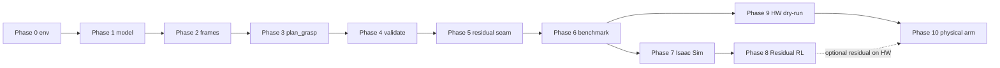

# Implementation phases — MyCobot 280 M5 Constrained Approach Planner

Authoritative acceptance criteria remain in [`spec.md`](../spec.md) §8.
This document is the operational roadmap: what each phase delivers, what it
must not do, and how later Isaac / residual-RL / hardware work attaches without
weakening the cuRobo-owned planner.

## Phase map

| Phase | Name | Gate before next phase |
|-------|------|------------------------|
| **0** | Repository bootstrap & environment verification | Version guard + unit suite green |
| **1** | Robot model & cuRobo robot configuration | FK / joint names / spheres validated |
| **2** | Surface target & task-frame generation | Frame + roll candidates deterministic |
| **3** | cuRobo nominal planning (`plan_grasp`) | Approach-only plans on empty/obstacle scenes |
| **4** | Independent trajectory verification | Fail-closed validation report |
| **5** | Execution abstraction & residual-correction seam | `ZeroResidualCorrector` + `SafetyProjector` |
| **6** | Randomized workspace benchmark | JSON/Markdown metrics, failure taxonomy |
| **7** | Isaac Sim closed-loop visualization & sim validation | GUI/headless smoke of validated plans |
| **8** | Bounded residual RL (Isaac Lab / Isaac Sim only) | Residual improves sim metrics; never replaces planner |
| **9** | Hardware interface & dry-run execution | Adapter tested with motion disabled |
| **10** | Physical MyCobot 280 M5 validation | Gated hardware runs; no sim accuracy claims |

Phases **0–6** are the **initial project** (definition of done in `spec.md` §14).
Phases **7–10** are explicitly planned extensions. Scaffolding for Phase 7
(Isaac host scripts, URDF helpers, vendor obtain script) may land early, but
must not become a Phase 0–6 runtime dependency of `mycobot_curobo`.

---

## Phase 0 — Bootstrap and environment verification

**Objective:** Reproducible Python project that fails closed without cuRobo v0.8.0.

**Deliverables:** `pyproject.toml`, `version_guard`, `verify_environment.py`, unit + GPU-marked import tests.

**Must not:** Import Isaac, ROS, `pymycobot`, or RL frameworks into the core package.

---

## Phase 1 — MyCobot 280 M5 model and cuRobo configuration

**Objective:** Authoritative robot YAML + collision spheres + TCP, with provenance.

**Deliverables:** `config/robots/mycobot_280_m5.yml`, sphere set, inspect script, FK tests.

**Must not:** Treat v2 URDF copies as accepted without license/revision review.

---

## Phase 2 — Surface target and task-frame generation

**Objective:** Build full task frames (position + orientation + approach axis) from surface targets.

**Deliverables:** `frames.py`, `targets.py`, roll-candidate goal sets, degeneracy handling.

---

## Phase 3 — cuRobo nominal planning

**Objective:** `MotionPlanner.plan_grasp` owns free-space + terminal approach.

**Deliverables:** Planner factory, fresh-backend-per-`plan_grasp` lifecycle for
the pinned v0.8.0 runtime, result mapping, and optional fallback only as
documented. Reuse may return only after a future pinned version passes the GPU
repeated-call regression.

**Must not:** Legacy `MotionGen`, moving collision spheres for path shaping, distance-only planner switching.

---

## Phase 4 — Independent trajectory verification

**Objective:** Re-check every candidate with FK-based geometry before executable status.

**Deliverables:** Lateral error, orientation error, progress monotonicity, collision/smoothness checks, fail-closed reports.

---

## Phase 5 — Execution abstraction and residual-correction seam

**Objective:** Separate planning from “would execute,” and reserve a **bounded Cartesian residual** hook.

**Deliverables:** `ZeroResidualCorrector`, `SafetyProjector`, execution interface that always re-validates after correction.

**Why residual (not e2e IK/RL):** The deployed path remains `nominal_plan` then optional clamped residual. Learning must not map target pose → full 6-DOF joints as primary behavior (see `spec.md` §4.6 / §6.5).

---

## Phase 6 — Randomized workspace benchmark

**Objective:** Reproducible success/failure metrics and taxonomy.

**Deliverables:** Benchmark CLI, JSON + Markdown reports under `artifacts/benchmarks/`.

**Initial-project exit:** When Phase 6 acceptance passes, the core planner is “done” without Isaac/RL/hardware.

---

## Phase 7 — Isaac Sim closed-loop visualization and sim validation

**Objective:** Load MyCobot in Isaac Sim, play validated joint trajectories, and report sim FK / tip metrics.

**Why this phase exists:** Planning success in cuRobo is necessary but not sufficient for teachability and sim regression. Isaac is the closed-loop visual oracle for approach-axis and orientation constraints.

**Deliverables (planned):**

- Host launch / env scripts (`scripts/host/*`, `scripts/isaac_sim_env.sh`) — **scaffolded now**;
- URDF→USD conversion and import helpers (`isaac_sim/*`) — **scaffolded now**;
- Scene + trajectory player that consumes `NominalPlan` + `ConstraintReport`;
- Headless and GUI smoke gates (host GPU only).

**Must not:**

- Move the authoritative planner into Isaac;
- Claim physical accuracy from sim thresholds;
- Require Kit inside the Isaac ROS container (prefer DGX Spark host).

**Entry criteria:** Phases 0–6 acceptance green (or at minimum Phases 0–4 if only visualization of validated stubs is needed — prefer full Phase 6).

---

## Phase 8 — Bounded residual RL (Isaac Lab / Isaac Sim)

**Objective:** Train a residual policy that outputs a **bounded Cartesian correction** (and/or small joint residual mapped through the Phase 5 seam), improving sim approach metrics under model mismatch — without replacing cuRobo planning.

**Why Residual RL makes sense here:**

1. The hard problem is already solved by cuRobo (`plan_grasp` + independent validation).
2. Residual learning targets systematic bias (TCP calibration, soft contact, sim-to-real gap) that classical planning cannot absorb without unsafe heuristics.
3. The Phase 5 seam (`ResidualCorrector` + `SafetyProjector`) was designed for this; e2e pose→joints would violate the project architecture.

**Deliverables (planned):**

- Isaac Lab / Isaac Sim training env wrapping the Phase 5 observation contract;
- Clamped residual bounds (defaults aligned with safety projector);
- Offline eval: residual vs zero-residual on Phase 6 benchmark scenes in sim;
- Checkpoints treated as advisory — validation failure → fall back to nominal plan / no motion.

**Must not:**

- Command the physical MyCobot during training;
- Bypass `SafetyProjector` or Phase 4 validation;
- Ship a primary policy that outputs full joint solutions.

**Entry criteria:** Phase 7 smokes pass; Phase 5 seam stable; Phase 6 baseline metrics recorded for comparison.

---

## Phase 9 — Hardware interface and dry-run execution

**Objective:** Adapter from validated plans to MyCobot 280 M5 command API with motion **disabled by default**.

**Deliverables (planned):**

- Hardware state/command protocol behind domain interfaces;
- Dry-run mode that logs intended joint commands without serial/network motion;
- Explicit `ENABLE_MYCOBOT_HARDWARE_TESTS=1` (or equivalent) for any live command path;
- Stale-state rejection and e-stop documentation.

**Must not:** Import hardware stacks into `planner.py` / `validation.py`.

**Entry criteria:** Phase 5 execution abstraction complete; Phase 6 taxonomy stable.

---

## Phase 10 — Physical MyCobot 280 M5 validation

**Objective:** Gated on-robot tests of approach success, repeatability, and safe failure modes.

**Deliverables (planned):**

- Hardware test plan with reduced speed / workspace envelopes;
- Logged trials (target, plan status, validation, residual on/off, measured tip error when instrumentation exists);
- Explicit reporting that separates sim metrics from measured hardware metrics;
- Optional evaluation of Phase 8 residual **only** after zero-residual hardware baseline.

**Must not:**

- Claim sub-millimeter accuracy without measured hardware evidence;
- Run unsupervised RL updates on the physical arm;
- Disable independent validation for “demo” convenience.

**Entry criteria:** Phase 9 dry-run green; operator present; robot-side limits verified.

---

## Scaffolding already present for Phase 7 (not Phase 0 acceptance)

| Resource | Source | Notes |
|----------|--------|-------|
| `scripts/isaac_sim_env.sh` | v2 | Resolve host `python.sh` |
| `scripts/host/env.isaac_host.sh` | v2 → v3 paths | Host env + log helpers |
| `scripts/host/spark_host_exec.sh` | v2 → v3 paths | Container → host `nsenter` |
| `scripts/host/launch_isaac_sim.sh` | v2 | Empty-stage GUI launch |
| `scripts/host/check_prereqs.sh` | v2 | Isaac + vendor URDF check |
| `scripts/host/install_curobo.sh` | v2; pin **v0.8.0** | Install into Isaac Sim python |
| `scripts/download_mycobot_ros2.sh` | v2 | Vendor URDF+meshes |
| `scripts/convert_urdf_to_usd.sh` + `isaac_sim/*` | v2 | Import workarounds |
| `assets/mycobot_280_m5/urdf/*` | v2 staging | Phase 1 must re-validate |
| `third_party/mycobot_ros2` | sibling symlink | Local only; gitignored |

**Deliberately not copied from v2:** `run_ik_viz.py`, residual IK recovery, ROS 2 packages, supervised/RL training stacks, MotionGen integration, and v2 metrics/status claims.
