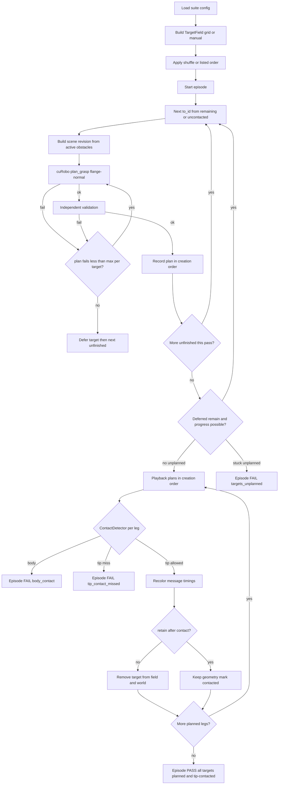

# Phase 7.2 — Multi-target tip-contact clearance suite

## Status

**Complete** (including deferral / reconsider / all-targets-planned). Budgets:
`max_planning_failure_per_target`, `max_reconsider_passes` (default
`target_count`), `max_failed_episodes`. Playback follows plan-creation order.
`--no-auto-exit` continuous replay is landed. Normative criteria remain in
[`spec.md`](../spec.md) §8 Phase 7.2.

Authoritative acceptance criteria are in [`spec.md`](../spec.md) §8.

## Purpose

Stress cuRobo planning and Isaac playback on a **numbered multi-target field**
whose contact order is configurable (`shuffle` or `listed`). The flange tip /
configured EE contact face approaches each target along the flange-normal
approach axis. Allowed tip/EE contact may remove or retain the target;
**any target contact with the arm body fails the episode**.

Phase 7.2 extends, but does not replace:

- Phase 7.1 single-cube standoff suite (Modes A–D, zero commanded contact);
- Phase 6 deterministic sampling, failure taxonomy, and replay;
- Phase 4 independent validation; and
- Phase 7 Isaac validated-plan playback.

An episode **PASS**es only when **every** field target ends with a successful
validated plan and tip contact (removed when configured), playback order matches
plan-creation order, tip miss after a successful plan aborts immediately, and
there is zero prohibited body–target contact. Deferred targets are reconsidered
after tip-removals; any remaining unplanned target fails the episode
(`targets_unplanned`).

## Documentation conventions

- **Design / call flow:** this phase report (mermaid below).
- **Normative acceptance:** `spec.md` §8 Phase 7.2.
- **README:** short status pointer and optional summary mermaid only.
- **Docstrings:** public modules, classes, and methods get concise one-line
  descriptions. Google-style `Args` / `Returns` blocks are reserved for
  non-obvious public contracts (multi-target scheduler, contact classifier,
  episode aggregator). Private helpers need docstrings only when behavior is
  non-obvious.

## Multi-target API (core, Isaac-free)

`plan_grasp` remains **one target per call**. Multi-target behavior is
orchestration over successive validated plans with an explicit world revision.

| Contract | Role |
|----------|------|
| `TargetField` | Numbered `SurfaceTarget` set with placement and order policy |
| `placement: grid \| manual` | Deterministic grid in a declared AABB, or caller-supplied list |
| `order: shuffle \| listed` | Seeded permutation of active IDs, or preserve list order |
| `retain_targets_after_contact` | `false` (default): remove on tip contact; `true`: keep geometry |
| `MultiTargetEpisodeRunner` | Leg loop: plan → validate → execute/play → contact → retry/advance |
| `ContactDetector` protocol | Returns tip-allowed / body-prohibited / none (Isaac or HW) |
| `max_planning_failure_per_target` | Per-target planning-failure ceiling before deferral (default **`3`**) |
| `max_reconsider_passes` | Reconsider passes over deferred targets (default **`target_count`**) |
| `max_failed_episodes` | Suite acceptance budget on failed episodes (default **`0`**) |
| `max_target_failures` | Deprecated; must not allow PASS with unplanned targets |

### Placement

- **`grid`:** build an evenly spaced **XY** lattice inside a declared `g_base`
  AABB. Z centres are spaced evenly in a band of width
  `0.5 * arm_z_motion_range_m` centered on the AABB mid-height
  (`(z_min + z_max) / 2`). `arm_z_motion_range_m` is an explicit declared
  vertical envelope (typically the vendor working radius); the Z band is not
  clipped to the thin field AABB Z span. Geometry is deterministic from
  config; only contact **order** is shuffled when `order: shuffle`.
  Generated centres must also satisfy **approach-plane EE clearance** (see
  `spec.md`): pairwise distance in the plane ⊥ `outward_normal_base` ≥
  `target_edge_m + flange_diameter_assumption_m + ee_approach_clearance_m`
  (default `ee_approach_clearance_m = flange_diameter_assumption_m`) so two
  remaining neighbors cannot mutually deadlock tip/EE approach. Z-band
  offsets must not count as clearance. Optional rim guard rejects
  workspace-edge centres.
- **`manual`:** caller provides the full numbered target list (id, position,
  normal, roll policy). No position sampling; lists fail closed if they
  violate the effective EE-clearance minimum.

### Contact order

- **`shuffle`:** seeded random permutation; exactly replayable from root seed.
- **`listed`:** contact in the supplied / grid enumeration order.

### After tip contact

- **`retain_targets_after_contact: false` (acceptance default):** recolor,
  message, timings; remove from viewport and from cuRobo world geometry so the
  obstacle field shrinks.
- **`retain_targets_after_contact: true`:** recolor, message, timings; mark
  contacted; leave collision geometry in place for subsequent plans (physical
  default later).

### Failures — planning, target, episode

Three tiers:

1. **Planning failure:** each failed plan/validation attempt for the current
   target increments `current_count_planning_failure_per_target`. Retry the
   same target until success or the count **reaches**
   `max_planning_failure_per_target` (default **`3`**) → **defer** the target
   and process the next unfinished id (exactly that many failures; not one more).
2. **Deferral / reconsider:** deferred targets are reconsidered after
   tip-contact removals (`max_reconsider_passes`, default **`target_count`**).
   If any target remains unplanned → **episode failure** (`targets_unplanned`).
3. **Episode failure:** suite `failed_episodes` must be
   `<= max_failed_episodes` (default **`0`**) for acceptance.

Tip contact is required for every planned leg that is played. Tip miss →
episode **FAIL** (`tip_contact_missed`) immediately. Exceeding per-target
planning retries **defers** the target for reconsider after tip-removals; the
episode still **FAIL**s if any target remains unplanned at the end
(`targets_unplanned`). See `spec.md` §8 Phase 7.2.

| Name | Kind | Default | Role |
|------|------|---------|------|
| `current_count_planning_failure_per_target` | Observed | starts at `0` | Planning failures for the active target (resets on advance / reconsider) |
| `max_planning_failure_per_target` | Config | **`3`** | Per-target planning-failure ceiling before deferral |
| `max_reconsider_passes` | Config | **`target_count`** | Ceiling on reconsider passes over deferred targets |
| `max_failed_episodes` | Config | **`0`** | Suite acceptance ceiling on failed episodes |
| `max_target_failures` | Config (deprecated) | **`3`** | Must not allow PASS with unplanned targets |


### Flange-normal approach

Terminal approach is opposite the outward face normal and aligned to the
configured signed TCP approach axis (bare-flange tip / tool +Z with
`tool_approach_sign: +1` unless explicitly reconfigured). Allowed contact is
tip/EE allow-list only.

### Planning obstacles

Each leg builds the cuRobo world (and independent world clearance) from
**targets that remain after tip-contact removals** when
`retain_targets_after_contact` is false. Tip-contacted cubes are gone. The
**active contact** cube is also omitted so the tip can occupy the face centre.
All other still-present targets stay as cuboid obstacles for **tip and body**.
Multi-target `plan_grasp` uses empty `disable_collision_links`;
`tip_allow_link_names` is for Isaac PhysX tip-vs-body classification only.

### Deferral, reconsider, and all-targets-planned

Normative detail: `spec.md` §8 Phase 7.2 **Clearance, deferral, and reconsider**.
Implemented in `MultiTargetEpisodeRunner` on `wip_phase7_3`.

- Exceeding `max_planning_failure_per_target` **defers** the target for the
  current pass (does not permanently clear the episode requirement).
- After tip-contact removals shrink the obstacle set, **reconsider** deferred
  targets (reset per-target attempt counters).
- Episode **FAIL** (`targets_unplanned`) if a pass ends with deferred targets
  and **no tip-contact progress** (including a first pass that defers every
  target) — do not replan the unchanged field. Also FAIL if any target remains
  unplanned after reconsider is exhausted.
- Playback replays successful legs in **plan-creation order**.

## Call and control flow



Host Isaac path keeps the Phase 7.1 split: **planning process** (cuRobo only)
then **playback process** (Kit only). Core orchestration must not import Kit.

## Isaac host consumer

- Visible numbered labels matching `target_id` in logs/JSON: high-contrast
  bright red 7-segment digit geometry (non-colliding cubes) above each target via
  `add_target_label`, plus `target_id` custom data for cross-checks. Labels are
  parented under each cube with a **local** Z offset only (world `center_m` on
  the child would double-count the parent translate and hide digits off-camera).
- Target cube highlight colors: default blue (idle); **yellow** when the current
  validated leg is pending tip contact; **green** on allowed tip contact;
  **red** on tip-contact miss or prohibited body contact.
- Tip-contact recolor + viewport message with `planning_duration_s`,
  `motion_duration_s`, and `time_to_contact_s`.
- Distinct body-contact recolor and fail message.
- Dual logging: bash terminal and Isaac Sim console for per-leg and episode
  timings.
- Failed plans logged as `plan_failed from_id→to_id` (use `start` when leaving
  the episode start state); each failed attempt increments
  `current_count_planning_failure_per_target`.
- Suite summaries report `failed_episodes`, `total_planning_failures`, and
  `total_target_failures` separately.

## Timing and Orin AGX note

Record per-leg `planning_duration_s`, `motion_duration_s`,
`time_to_contact_s` (= plan + motion through first allowed tip contact), and
per-episode `episode_duration_s` plus `planning_failure_count` /
`target_failure_count`.

Suite rollups include episode pass/fail counts, `failed_episodes`,
`total_planning_failures`, and `total_target_failures`.

These are **Spark host / sim GPU evidence** for trend review (for example
planning cost as remaining obstacles change). They do **not** establish Orin
AGX real-time budgets: different compute stack, plus hardware state I/O,
safety projection, and command latency. Orin wall-clock and control-rate gates
belong to Phases 10–11. Optional advisory `warn_planning_duration_s` may log a
warning without failing the suite.

## Hardware transfer surfaces

Phase 7.2 designs the following so Phases 10–11 can reuse the same runner with
swapped adapters (see also `spec.md` “Remaining future adapters”):

| Surface | Sim (7.2) | Physical (later) |
|---------|-----------|------------------|
| `MultiTargetEpisodeRunner` | Isaac playback | Phase 5 execution seam + HW adapter |
| `TargetField` manual + listed | Scripted fixtures | Taught / measured poses |
| `retain_targets_after_contact=true` | Optional mode | Default (targets do not despawn) |
| `ContactDetector` | PhysX tip vs body | Force/current/torque or gated ack |
| `TargetPoseSource` | Config / manual list | Perception or teach adapter |
| `SceneRevision` | Remaining/retained cubes | Fixture map or online scene update |
| `MotionGate` | Always allowed in sim smoke | Dry-run / enable-flag / e-stop ack |
| `LatencyBudgetRecorder` | Console + JSON | Orin field evidence channel |
| Episode / leg report schema | Same JSON | Same JSON (sim vs HW labeled) |

**Suggested HW defaults when that work lands:** `placement=manual`,
`order=listed`, `retain_targets_after_contact=true`.

Isaac-only (not core): viewport labels, recolor, Kit messages, PhysX
subscription details, USD spawn/despawn.

## Configuration

Validated named YAML (`config/phase7_2_multi_target.yml` and variants):

- `target_count`, `episode_count` (positive integers);
- `placement`, optional manual target list;
- `order` (`shuffle` \| `listed`);
- `retain_targets_after_contact` (default `false`);
- `max_planning_failure_per_target` defaulting to **`3`**;
- `max_target_failures` defaulting to **`3`**;
- `max_failed_episodes` defaulting to **`0`**;
- root seed; tip/EE allow-list link names; body-prohibited policy;
- planner/validation/scene profiles; lighting; report paths;
- optional `warn_planning_duration_s`.

Host CLI overrides (normative detail in `spec.md` §8 / §9):

- `--targets N` / `--episodes N` on `plan_multi_target_suite.py` and
  `smoke_phase7_2_multi_target.sh`.
- Artifact tags: `N`, `epM`, or `NxM` when overrides are set.

```bash
./scripts/host/smoke_phase7_2_multi_target.sh --gui --no-auto-exit --targets 10 --episodes 5
```

### Integration smoke (2 episodes × 5 targets)

Opt-in host gate (not part of default spark GUI smoke):

```bash
./scripts/host/smoke_phase7_2_integration_2x5.sh --headless --auto-exit
./scripts/host/smoke_phase7_2_integration_2x5.sh --gui --auto-exit
# or
./scripts/run_verification.sh spark --with-integration-smoke
```

Uses `config/phase7_2_multi_target_integration_2x5.yml` (grid + shuffle). Each
episode gets a distinct grid `placement_seed` and planner `episode_seed` so
target placement and planned paths differ. Required by Phase 1.1 acceptance
before re-arming denser collision spheres (`spec.md` §8 Phase 1.1).

With `--no-auto-exit`, Kit **replays** episodes indefinitely after the first
pass (close the window or Ctrl+C). Planning non-zero exit does not skip
playback when a bundle was written; plan-failed episodes with validated legs
are still animated.

### Placement / viewport / anti-graze (integration 2×5)

- Multi-quadrant **open arc** (`placement: layout`, `radius_m: 0.20`,
  `span_rad: 4.2` ≈ 240° about `g_base`, keep-out ±0.12, field
  `[-0.24,-0.24]…[0.24,0.24]`, rim `0.36`). Replaces the prior X≥0 forward
  grid that clustered all centres in the +X half. Centres span ±X and ±Y
  (including −X). A closed full ring left a brittle rear tip-contact under
  some shuffle seeds; the open arc is the accepted integration trade-off.
- GUI framing: `compute_viewport_framing` from arm envelope ∪ all target
  bounds (closest view that keeps content in frame; defaults remain fallback).
- Anti-graze: `optimizer_collision_activation_distance_m: 0.01` on
  `benchmark_reproducible` / `planning_high_effort`; suite
  `minimum_world_collision_clearance_m: 0.004`. Keep `pre_approach_distance_m:
  0.01` (A/B: `0.025` forced start→target `plan_failed`).
- One-knob A/B (1 ep × 2 targets, packing-safe baseline field): baseline PASS;
  rolls PASS. Root cause of prior `planning_high_effort` `plan_failed` on
  `2→1`: **`num_ik_seeds: 64`** (grasp segment; not validation). Fixed profile
  keeps IK seeds at **32**, trajopt **8**, attempts **4**, orient tol **0.05**.
  Confirmed packing-safe 1×2 PASS. Integration YAML remains
  `benchmark_reproducible` until a deliberate 2×5 re-enable.
- **Flange-face containment:** optional suite flag
  `require_flange_face_containment` fails validation when the flange disk
  overhangs the contact face beyond `flange_face_overhang_tolerance_m`
  (default `0.005` m ≈ planner position tolerance). Metric:
  `flange_disk_face_overhang_m` in `cube_scene.py`. Integration 2×5 enables
  this with `target_edge_m: 0.031` (≥ flange Ø) so tip contact is not an
  expected edge clip. Default 14 mm suites leave the flag off; PhysX tip
  classification still treats active-target flange/edge contacts as allowed tip.
- **Workspace map (before field expand):** host sampler
  `scripts/host/measure_tip_contact_workspace.py` +
  `mycobot_curobo.tip_contact_workspace` writes
  `artifacts/workspace/tip_contact_workspace_v1.json` (declaration
  `measured_tip_contact_candidate_region_v1`). Host GPU v1: 86/114 successes
  at step `0.06` m, Z layers `{0.10, 0.22}` m under rim `0.28` — **candidate
  region evidence**, not a full dexterous-workspace claim. Do not relabel the
  integration AABB from this artifact until placement acceptance is agreed.

## Acceptance criteria (summary)

See `spec.md` §8 Phase 7.2 for the normative list. Highlights:

- Parameterized target/episode counts; grid or manual; shuffle or listed;
  retain or remove; seeded replay.
- Flange-normal tip contact; body–target contact fails closed.
- Retry same leg until success or fail budget.
- Planning / target / episode failure budgets as above; suite acceptance
  requires `failed_episodes <= max_failed_episodes` (default **`0`**).
- Dual console timing; no Orin SLA claim from sim timings.
- Phase 7 / 7.1 smoke gates remain mandatory for Isaac-path changes.
- No hardware command, alternate planner, or physical-accuracy claim.

## Relationship to Phase 7.1

| | Phase 7.1 | Phase 7.2 |
|---|-----------|-----------|
| Targets | One cube per episode | Many numbered targets per episode |
| Terminal | Positive standoff; contact not commanded | Tip contact commanded / detected |
| Obstacle field | Single cube | Shrinking or retained multi-target field |
| Success | Approach metrics + zero prohibited contact | Non-failed targets tip-contacted; planning-failed targets ignored for tip |

## Implementation checklist

- [x] Core `TargetField` / order / retain / runner unit tests
- [x] Config schema + validation
- [x] Isaac visualizer + tip/body `ContactDetector`
- [x] Plan/playback host scripts and smoke gates
- [x] Console/JSON timing and from→to failure rows
- [x] Planning / target / episode failure counters and budgets
- [x] Landing docs / `main` fast-forward after GUI review
