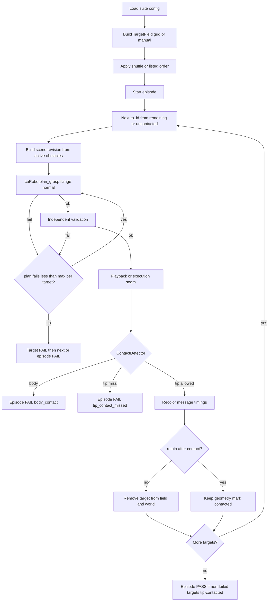

# Phase 7.2 — Multi-target tip-contact clearance suite

## Status

**Implemented on `wip_phase7_2`.** Two-scope plan-failure counting
(`max_planning_failure_per_target` / `max_target_failures` /
`max_failed_episodes`) is wired in `mycobot_curobo.multi_target`. Normative
criteria remain in [`spec.md`](../spec.md) §8 Phase 7.2.

Authoritative acceptance criteria are in [`spec.md`](../spec.md) §8.

## Purpose

Stress cuRobo planning and Isaac playback on a **numbered multi-target field**
whose contact order is configurable (`shuffle` or `listed`). The flange tip /
configured EE contact face approaches each target along the flange-normal
approach axis. Allowed tip/EE contact may remove or retain the target;
**any target contact with the arm body fails the episode**.

Phase 7.2 extends, but does not replace:

- Phase 7.1 single-cube standoff suite (Modes A–D, zero commanded contact);
- Phase 6 deterministic sampling, failure taxonomy, and replay;
- Phase 4 independent validation; and
- Phase 7 Isaac validated-plan playback.

An episode succeeds when every **non-failed** target is tip-contacted (and
removed when configured), planning-failed targets are within
`max_target_failures`, tip miss after a successful plan aborts immediately, and
there is zero prohibited body–target contact. Tip contact is not required for
targets that never attempted motion.

## Documentation conventions

- **Design / call flow:** this phase report (mermaid below).
- **Normative acceptance:** `spec.md` §8 Phase 7.2.
- **README:** short status pointer and optional summary mermaid only.
- **Docstrings:** public modules, classes, and methods get concise one-line
  descriptions. Google-style `Args` / `Returns` blocks are reserved for
  non-obvious public contracts (multi-target scheduler, contact classifier,
  episode aggregator). Private helpers need docstrings only when behavior is
  non-obvious.

## Multi-target API (core, Isaac-free)

`plan_grasp` remains **one target per call**. Multi-target behavior is
orchestration over successive validated plans with an explicit world revision.

| Contract | Role |
|----------|------|
| `TargetField` | Numbered `SurfaceTarget` set with placement and order policy |
| `placement: grid \| manual` | Deterministic grid in a declared AABB, or caller-supplied list |
| `order: shuffle \| listed` | Seeded permutation of active IDs, or preserve list order |
| `retain_targets_after_contact` | `false` (default): remove on tip contact; `true`: keep geometry |
| `MultiTargetEpisodeRunner` | Leg loop: plan → validate → execute/play → contact → retry/advance |
| `ContactDetector` protocol | Returns tip-allowed / body-prohibited / none (Isaac or HW) |
| `max_planning_failure_per_target` | Per-target planning-failure ceiling (default **`5`**) |
| `max_target_failures` | Episode budget on failed targets (default = `floor(target_count / 2)`) |
| `max_failed_episodes` | Suite acceptance budget on failed episodes (default **`0`**) |

### Placement

- **`grid`:** build an evenly spaced grid inside a declared `g_base` AABB.
  Geometry is deterministic from config; only contact **order** is shuffled
  when `order: shuffle`.
- **`manual`:** caller provides the full numbered target list (id, position,
  normal, roll policy). No position sampling.

### Contact order

- **`shuffle`:** seeded random permutation; exactly replayable from root seed.
- **`listed`:** contact in the supplied / grid enumeration order.

### After tip contact

- **`retain_targets_after_contact: false` (acceptance default):** recolor,
  message, timings; remove from viewport and from cuRobo world geometry so the
  obstacle field shrinks.
- **`retain_targets_after_contact: true`:** recolor, message, timings; mark
  contacted; leave collision geometry in place for subsequent plans (physical
  default later).

### Failures — planning, target, episode

Three tiers:

1. **Planning failure:** each failed plan/validation attempt for the current
   target increments `current_count_planning_failure_per_target`. Retry the
   same target until success or the count **exceeds**
   `max_planning_failure_per_target` (default **`5`**) → **target failure**.
2. **Target failure:** increment episode `target_failure_count` and skip to the
   next target. If `target_failure_count` **exceeds** `max_target_failures`
   (default = `floor(target_count / 2)`) → **episode failure**.
3. **Episode failure:** suite `failed_episodes` must be
   `<= max_failed_episodes` (default **`0`**) for acceptance.

Tip contact is required only for targets whose plan/validation succeeded and
whose motion ran. After such a leg, tip miss → episode **FAIL**
(`tip_contact_missed`) immediately. Planning-failed targets skip motion; their
missing tip contact does not fail the episode by itself.

| Name | Kind | Default | Role |
|------|------|---------|------|
| `current_count_planning_failure_per_target` | Observed | starts at `0` | Planning failures for the active target (resets on advance) |
| `max_planning_failure_per_target` | Config | **`5`** | Per-target planning-failure ceiling |
| `max_target_failures` | Config | `floor(target_count / 2)` | Episode ceiling on failed targets |
| `max_failed_episodes` | Config | **`0`** | Suite acceptance ceiling on failed episodes |


### Flange-normal approach

Terminal approach is opposite the outward face normal and aligned to the
configured signed TCP approach axis (bare-flange tip / tool +Z with
`tool_approach_sign: +1` unless explicitly reconfigured). Allowed contact is
tip/EE allow-list only.

## Call and control flow



Host Isaac path keeps the Phase 7.1 split: **planning process** (cuRobo only)
then **playback process** (Kit only). Core orchestration must not import Kit.

## Isaac host consumer

- Visible numbered labels matching `target_id` in logs/JSON.
- Tip-contact recolor + viewport message with `planning_duration_s`,
  `motion_duration_s`, and `time_to_contact_s`.
- Distinct body-contact recolor and fail message.
- Dual logging: bash terminal and Isaac Sim console for per-leg and episode
  timings.
- Failed plans logged as `plan_failed from_id→to_id` (use `start` when leaving
  the episode start state); each failed attempt increments
  `current_count_planning_failure_per_target`.
- Suite summaries report `failed_episodes`, `total_planning_failures`, and
  `total_target_failures` separately.

## Timing and Orin AGX note

Record per-leg `planning_duration_s`, `motion_duration_s`,
`time_to_contact_s` (= plan + motion through first allowed tip contact), and
per-episode `episode_duration_s` plus `planning_failure_count` /
`target_failure_count`.

Suite rollups include episode pass/fail counts, `failed_episodes`,
`total_planning_failures`, and `total_target_failures`.

These are **Spark host / sim GPU evidence** for trend review (for example
planning cost as remaining obstacles change). They do **not** establish Orin
AGX real-time budgets: different compute stack, plus hardware state I/O,
safety projection, and command latency. Orin wall-clock and control-rate gates
belong to Phases 10–11. Optional advisory `warn_planning_duration_s` may log a
warning without failing the suite.

## Hardware transfer surfaces

Phase 7.2 designs the following so Phases 10–11 can reuse the same runner with
swapped adapters (see also `spec.md` “Remaining future adapters”):

| Surface | Sim (7.2) | Physical (later) |
|---------|-----------|------------------|
| `MultiTargetEpisodeRunner` | Isaac playback | Phase 5 execution seam + HW adapter |
| `TargetField` manual + listed | Scripted fixtures | Taught / measured poses |
| `retain_targets_after_contact=true` | Optional mode | Default (targets do not despawn) |
| `ContactDetector` | PhysX tip vs body | Force/current/torque or gated ack |
| `TargetPoseSource` | Config / manual list | Perception or teach adapter |
| `SceneRevision` | Remaining/retained cubes | Fixture map or online scene update |
| `MotionGate` | Always allowed in sim smoke | Dry-run / enable-flag / e-stop ack |
| `LatencyBudgetRecorder` | Console + JSON | Orin field evidence channel |
| Episode / leg report schema | Same JSON | Same JSON (sim vs HW labeled) |

**Suggested HW defaults when that work lands:** `placement=manual`,
`order=listed`, `retain_targets_after_contact=true`.

Isaac-only (not core): viewport labels, recolor, Kit messages, PhysX
subscription details, USD spawn/despawn.

## Configuration

Validated named YAML (`config/phase7_2_multi_target.yml` and variants):

- `target_count`, `episode_count` (positive integers);
- `placement`, optional manual target list;
- `order` (`shuffle` \| `listed`);
- `retain_targets_after_contact` (default `false`);
- `max_planning_failure_per_target` defaulting to **`5`**;
- `max_target_failures` defaulting to **`floor(target_count / 2)`**;
- `max_failed_episodes` defaulting to **`0`**;
- root seed; tip/EE allow-list link names; body-prohibited policy;
- planner/validation/scene profiles; lighting; report paths;
- optional `warn_planning_duration_s`.

Host CLI overrides (normative detail in `spec.md` §8 / §9):

- `--targets N` / `--episodes N` on `plan_multi_target_suite.py` and
  `smoke_phase7_2_multi_target.sh`.
- Artifact tags: `N`, `epM`, or `NxM` when overrides are set.

```bash
./scripts/host/smoke_phase7_2_multi_target.sh --gui --no-auto-exit --targets 10 --episodes 5
```

## Acceptance criteria (summary)

See `spec.md` §8 Phase 7.2 for the normative list. Highlights:

- Parameterized target/episode counts; grid or manual; shuffle or listed;
  retain or remove; seeded replay.
- Flange-normal tip contact; body–target contact fails closed.
- Retry same leg until success or fail budget.
- Planning / target / episode failure budgets as above; suite acceptance
  requires `failed_episodes <= max_failed_episodes` (default **`0`**).
- Dual console timing; no Orin SLA claim from sim timings.
- Phase 7 / 7.1 smoke gates remain mandatory for Isaac-path changes.
- No hardware command, alternate planner, or physical-accuracy claim.

## Relationship to Phase 7.1

| | Phase 7.1 | Phase 7.2 |
|---|-----------|-----------|
| Targets | One cube per episode | Many numbered targets per episode |
| Terminal | Positive standoff; contact not commanded | Tip contact commanded / detected |
| Obstacle field | Single cube | Shrinking or retained multi-target field |
| Success | Approach metrics + zero prohibited contact | Non-failed targets tip-contacted; planning-failed targets ignored for tip |

## Implementation checklist

- [x] Core `TargetField` / order / retain / runner unit tests
- [x] Config schema + validation
- [x] Isaac visualizer + tip/body `ContactDetector`
- [x] Plan/playback host scripts and smoke gates
- [x] Console/JSON timing and from→to failure rows
- [x] Planning / target / episode failure counters and budgets
- [ ] Landing docs / `main` fast-forward after GUI review
